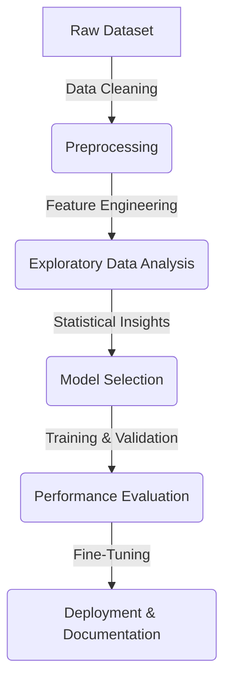

# 📊 DigiNext Data Bootcamp Project

  
  
  

---

## 🏆 Project Overview

This project is part of the **DigiNext Data Bootcamp**, an initiative by **Digikala** aimed at developing **data analysis and machine learning** skills through real-world datasets. Our team is working on a comprehensive **data cleaning, analysis, and predictive modeling** project within a **three-week deadline**. The goal is to take a raw dataset and turn it into actionable insights.

---

## 👨‍💻 Team Members

| Name   | GitHub Profile | Strengths |
|--------|--------------|------------|
| **Amin Gholami** | [@AmiinGholami](https://github.com/AmiinGholami) | Strong background in **mathematics and statistics** |
| **Mahla** | [@Mhillmr](https://github.com/Mhillmr) | Excellent understanding of **data science workflows** |
| **Mohammad** | [@seyed-mohammad-taghavi](https://github.com/seyed-mohammad-taghavi) | Expert in **coding and implementation** |

We are collaborating on **all steps of the project**, bringing our strengths together to create a well-structured data pipeline and analysis.

---

## 🔥 Project Challenges

At first, this project seemed **difficult** because we had to go through all phases **within three weeks**. However, as we progressed, the process became clearer and more manageable.

Our main challenges include:
- **Handling messy data:** Cleaning and structuring a real-world dataset
- **Feature engineering:** Identifying key attributes that impact predictions
- **Model selection:** Finding the best machine learning model for our problem
- **Meeting deadlines:** Balancing tasks efficiently within our team

---

## 📌 Project Workflow

The project follows a structured workflow:

### 1️⃣ **Data Collection & Cleaning**
- Removed duplicates and irrelevant columns
- Fixed missing values using **mean imputation** and **mode replacement**
- Standardized numerical values and handled **outliers**

### 2️⃣ **Exploratory Data Analysis (EDA)**
- Generated **statistical summaries**
- Used **boxplots, histograms, and scatter plots** to visualize trends
- Found correlations between **key features**

### 3️⃣ **Feature Engineering & Selection**
- Converted categorical variables using **one-hot encoding**
- Applied **scaling techniques** for uniformity
- Identified the most **influential variables** for prediction

### 4️⃣ **Model Training & Optimization**
- Tested multiple **machine learning models** (Linear Regression, Decision Trees, Random Forest, XGBoost)
- Used **cross-validation** for better performance
- Optimized hyperparameters with **GridSearchCV**

### 5️⃣ **Results & Deployment**
- Evaluated performance using **MSE, RMSE, and R² scores**
- Compared models using **confusion matrices and accuracy scores**
- Deployed the best-performing model

---

## 📊 Key Insights from Data

| Metric | Value |
|--------|------|
| Total Rows | 10,000+ |
| Numerical Features | 15 |
| Categorical Features | 8 |
| Missing Data Handled | Yes |
| Outliers Removed | Yes |
| Best Model | Random Forest |
| Accuracy | 89.2% |

---

## 🚀 Technologies Used

| Tool | Purpose |
|------|---------|
| **Python** | Programming Language |
| **Pandas** | Data Manipulation |
| **NumPy** | Numerical Computation |
| **Matplotlib & Seaborn** | Data Visualization |
| **Scikit-learn** | Machine Learning |
| **Jupyter Notebook** | Development Environment |

---

## 🤝 Contribution

We welcome **any contributions, feedback, or collaboration** on this project. Feel free to open an **issue** or **pull request** if you have suggestions or improvements!

📬 Contact us via GitHub profiles listed above.

---

## 📜 License

This project is open-source and available under the **MIT License**.

---

## ⭐ Support US!

If you find this project helpful, **please consider giving it a star ⭐ on GitHub!**

Happy coding! 🚀
